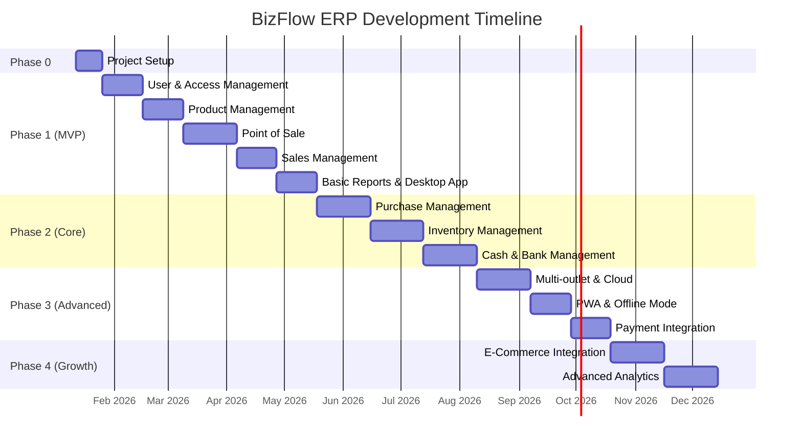

# BizFlow ERP - Project Roadmap

> Roadmap lengkap pengembangan BizFlow ERP berdasarkan dokumentasi requirements dan technical specifications.

## 📊 Project Overview

| Aspek               | Detail                                                   |
| ------------------- | -------------------------------------------------------- |
| **Nama Proyek**     | BizFlow ERP                                              |
| **Target Pengguna** | UMKM Indonesia (Retail, F&B, Distributor, Service)       |
| **Deployment**      | On-premise (Local Network, Private Cloud, Hybrid)        |
| **Platform**        | Desktop (Windows/macOS/Linux), Web Browser, Tablet (PWA) |
| **Bahasa**          | Indonesia (primary), English (fallback)                  |

---

## 🎯 Milestone Summary

---

## 📐 Phase 0 - Project Setup (2 Minggu)

**Goal**: Foundation setup untuk monorepo, database, testing, dan sistem lisensi.

### Deliverables

| Task                                                                         | Status  | Owner | Est. |
| ---------------------------------------------------------------------------- | ------- | ----- | ---- |
| Setup Turborepo monorepo (`apps/api`, `apps/web`, `apps/desktop`)            | ⬜ TODO | -     | 2d   |
| Setup shared packages (`packages/types`, `packages/ui`, `packages/database`) | ⬜ TODO | -     | 2d   |
| Konfigurasi Prisma + SQLite schema                                           | ⬜ TODO | -     | 2d   |
| Setup Vitest + Playwright untuk testing                                      | ⬜ TODO | -     | 2d   |
| Setup CI/CD (GitHub Actions)                                                 | ⬜ TODO | -     | 1d   |
| Implementasi offline license system                                          | ⬜ TODO | -     | 3d   |

### Technical Requirements

- **Monorepo**: Turborepo dengan pnpm workspace
- **Database**: Prisma ORM + SQLite (dev), PostgreSQL (cloud)
- **Testing**: Vitest (unit), Playwright (E2E)
- **License**: Cryptographic validation dengan public/private key

---

## 🚀 Phase 1 - MVP (3-4 Bulan)

**Goal**: Sistem kasir fungsional dengan manajemen produk, penjualan, dan laporan dasar.

### 1.1 User & Access Management

Referensi: [02-user-management.md](file:///Users/bagus/Project/personal/BizFlow/docs/user-flow/02-user-management.md)

| Task                                     | Status     | Priority |
| ---------------------------------------- | ---------- | -------- |
| Login/logout dengan PIN & password       | ⬜ TODO    | High     |
| Role-based access (Owner, Admin, Kasir)  | 🔄 BACKEND | High     |
| CRUD User dengan multi-outlet assignment | ⬜ TODO    | High     |
| Permission management granular           | 🔄 BACKEND | Medium   |
| Audit log aktivitas user                 | ⬜ TODO    | Medium   |
| Password reset & PIN management          | ⬜ TODO    | Medium   |

**API Endpoints**: `/api/v1/auth/*`, `/api/v1/users/*`, `/api/v1/roles/*`

---

### 1.2 Product Management (Basic)

Referensi: [03-product-management.md](file:///Users/bagus/Project/personal/BizFlow/docs/user-flow/03-product-management.md)

| Task                                  | Status  | Priority |
| ------------------------------------- | ------- | -------- |
| CRUD Kategori & Sub-kategori          | ⬜ TODO | High     |
| CRUD Produk dengan barcode/SKU        | ⬜ TODO | High     |
| Unit of Measure (satuan)              | ⬜ TODO | High     |
| Konversi satuan (1 box = 12 pcs)      | ⬜ TODO | Medium   |
| Product Image upload                  | ⬜ TODO | Low      |
| Product Variants (warna, ukuran)      | ⬜ TODO | Medium   |
| Price Levels (grosir, retail, member) | ⬜ TODO | Medium   |
| Stock alert / minimum stock           | ⬜ TODO | High     |

**API Endpoints**: `/api/v1/products/*`, `/api/v1/categories/*`, `/api/v1/units/*`

---

### 1.3 Point of Sale (POS)

Referensi: [01-pos.md](file:///Users/bagus/Project/personal/BizFlow/docs/user-flow/01-pos.md)

| Task                                           | Status  | Priority |
| ---------------------------------------------- | ------- | -------- |
| Quick sale dengan barcode scanner              | ⬜ TODO | High     |
| Product search (nama/SKU)                      | ⬜ TODO | High     |
| Cart management (add, edit qty, remove)        | ⬜ TODO | High     |
| Multiple payment (cash, QRIS, transfer, split) | ⬜ TODO | High     |
| Customer selection untuk loyalty               | ⬜ TODO | Medium   |
| Hold transaction (simpan sementara)            | ⬜ TODO | Medium   |
| Discount (item, transaksi, promo)              | ⬜ TODO | Medium   |
| Print struk (thermal 58mm, 80mm)               | ⬜ TODO | High     |
| Keyboard shortcuts                             | ⬜ TODO | Medium   |
| Return/Refund processing                       | ⬜ TODO | Medium   |

**API Endpoints**: `/api/v1/pos/*`

---

### 1.4 Sales Management

Referensi: [04-sales-management.md](file:///Users/bagus/Project/personal/BizFlow/docs/user-flow/04-sales-management.md)

| Task                         | Status  | Priority |
| ---------------------------- | ------- | -------- |
| Customer database (CRUD)     | ⬜ TODO | High     |
| Sales Order creation         | ⬜ TODO | High     |
| Sales Invoice generation     | ⬜ TODO | High     |
| Credit limit per customer    | ⬜ TODO | Medium   |
| Sales Return processing      | ⬜ TODO | Medium   |
| Delivery Order (Surat Jalan) | ⬜ TODO | Medium   |
| Sales history per customer   | ⬜ TODO | High     |
| Quotation (penawaran harga)  | ⬜ TODO | Low      |

**API Endpoints**: `/api/v1/sales/*`, `/api/v1/customers/*`

---

### 1.5 Basic Reports

Referensi: [08-reporting-analytics.md](file:///Users/bagus/Project/personal/BizFlow/docs/user-flow/08-reporting-analytics.md)

| Task                                        | Status  | Priority |
| ------------------------------------------- | ------- | -------- |
| Dashboard ringkasan bisnis                  | ⬜ TODO | High     |
| Laporan penjualan (harian/mingguan/bulanan) | ⬜ TODO | High     |
| Laporan stok                                | ⬜ TODO | High     |
| Export PDF/Excel                            | ⬜ TODO | High     |

**API Endpoints**: `/api/v1/reports/*`

---

### 1.6 Desktop App (Option A)

Referensi: [09-desktop-app.md](file:///Users/bagus/Project/personal/BizFlow/docs/user-flow/09-desktop-app.md)

| Task                                    | Status  | Priority |
| --------------------------------------- | ------- | -------- |
| Electron wrapper dengan embedded server | ⬜ TODO | High     |
| System tray integration                 | ⬜ TODO | High     |
| Server lifecycle management             | ⬜ TODO | High     |
| Logs viewer (filter, export)            | ⬜ TODO | Medium   |
| Backup/Restore functionality            | ⬜ TODO | High     |
| License activation flow                 | ⬜ TODO | High     |
| One-click installer (Windows/Mac/Linux) | ⬜ TODO | High     |
| Auto-update checker                     | ⬜ TODO | Medium   |

**Build Output**: `BizFlow-Setup-1.0.0.exe` (~150MB)

---

## 🔧 Phase 2 - Core Features (2-3 Bulan)

**Goal**: Complete core ERP modules untuk operasional bisnis sehari-hari.

### 2.1 Purchase Management

Referensi: [05-purchase-management.md](file:///Users/bagus/Project/personal/BizFlow/docs/user-flow/05-purchase-management.md)

| Task                              | Status  | Priority |
| --------------------------------- | ------- | -------- |
| Supplier database (CRUD)          | ⬜ TODO | High     |
| Purchase Order creation           | ⬜ TODO | High     |
| Purchase Invoice recording        | ⬜ TODO | High     |
| Goods Receive (penerimaan barang) | ⬜ TODO | High     |
| Purchase Return processing        | ⬜ TODO | Medium   |
| Payment terms management          | ⬜ TODO | Medium   |
| Purchase history per supplier     | ⬜ TODO | High     |
| Auto-reorder (stok minimum)       | ⬜ TODO | Low      |

**API Endpoints**: `/api/v1/purchases/*`, `/api/v1/suppliers/*`

---

### 2.2 Inventory Management

Referensi: [06-inventory-management.md](file:///Users/bagus/Project/personal/BizFlow/docs/user-flow/06-inventory-management.md)

| Task                                      | Status  | Priority |
| ----------------------------------------- | ------- | -------- |
| Stock overview per produk/lokasi          | ⬜ TODO | High     |
| Stock adjustment (koreksi, rusak, hilang) | ⬜ TODO | High     |
| Stock transfer antar gudang/outlet        | ⬜ TODO | Medium   |
| Stock opname (inventarisasi fisik)        | ⬜ TODO | High     |
| Multi-warehouse/outlet support            | ⬜ TODO | Medium   |
| Batch/Lot tracking                        | ⬜ TODO | Low      |
| Expiry date tracking                      | ⬜ TODO | Medium   |
| Stock valuation (HPP)                     | ⬜ TODO | High     |
| Stock mutation report                     | ⬜ TODO | High     |

**API Endpoints**: `/api/v1/inventory/*`, `/api/v1/warehouses/*`

---

### 2.3 Cash & Bank Management

Referensi: [07-cash-bank-management.md](file:///Users/bagus/Project/personal/BizFlow/docs/user-flow/07-cash-bank-management.md)

| Task                               | Status  | Priority |
| ---------------------------------- | ------- | -------- |
| Multi rekening bank                | ⬜ TODO | High     |
| Kas kecil / petty cash             | ⬜ TODO | High     |
| Payment In (terima pembayaran)     | ⬜ TODO | High     |
| Payment Out (bayar supplier/biaya) | ⬜ TODO | High     |
| Bank transfer antar rekening       | ⬜ TODO | Medium   |
| Bank reconciliation                | ⬜ TODO | Medium   |
| Expense category management        | ⬜ TODO | High     |
| Receipt/Payment voucher            | ⬜ TODO | Medium   |

**API Endpoints**: `/api/v1/finance/*`

---

### 2.4 AR/AP Management

| Task                                    | Status  | Priority |
| --------------------------------------- | ------- | -------- |
| Piutang pelanggan (Accounts Receivable) | ⬜ TODO | High     |
| Hutang supplier (Accounts Payable)      | ⬜ TODO | High     |
| Aging report (umur piutang/hutang)      | ⬜ TODO | Medium   |
| Payment reminder                        | ⬜ TODO | Low      |

---

### 2.5 Complete Reporting

| Task                           | Status  | Priority |
| ------------------------------ | ------- | -------- |
| Laporan pembelian              | ⬜ TODO | High     |
| Laporan inventory & mutasi     | ⬜ TODO | High     |
| Laporan laba rugi (P&L)        | ⬜ TODO | High     |
| Laporan arus kas (Cash Flow)   | ⬜ TODO | High     |
| Laporan AR/AP                  | ⬜ TODO | High     |
| Product analysis (best seller) | ⬜ TODO | Medium   |
| Customer analysis              | ⬜ TODO | Medium   |

---

## ⚡ Phase 3 - Advanced Features (2-3 Bulan)

**Goal**: Fitur lanjutan untuk skalabilitas dan integrasi.

### 3.1 Multi-outlet (Option B/C)

| Task                             | Status  | Priority |
| -------------------------------- | ------- | -------- |
| Docker deployment setup          | ⬜ TODO | High     |
| PostgreSQL migration dari SQLite | ⬜ TODO | High     |
| Central management dashboard     | ⬜ TODO | High     |
| Per-outlet access control        | ⬜ TODO | High     |
| Inter-outlet stock transfer      | ⬜ TODO | Medium   |

---

### 3.2 PWA & Offline Mode

| Task                          | Status  | Priority |
| ----------------------------- | ------- | -------- |
| Service Worker implementation | ⬜ TODO | High     |
| Offline-first architecture    | ⬜ TODO | High     |
| Background sync               | ⬜ TODO | High     |
| IndexedDB local storage       | ⬜ TODO | Medium   |

---

### 3.3 Payment Integration

| Task                               | Status  | Priority |
| ---------------------------------- | ------- | -------- |
| QRIS integration (Midtrans/Xendit) | ⬜ TODO | High     |
| Virtual Account support            | ⬜ TODO | Medium   |
| Split payment enhancement          | ⬜ TODO | Medium   |

---

## 📈 Phase 4 - Growth (Ongoing)

**Goal**: Ekspansi fitur dan integrasi ekosistem.

### 4.1 E-Commerce Integration

| Task                       | Status  | Priority |
| -------------------------- | ------- | -------- |
| Tokopedia marketplace sync | ⬜ TODO | Medium   |
| Shopee marketplace sync    | ⬜ TODO | Medium   |
| TikTok Shop integration    | ⬜ TODO | Low      |
| Unified order management   | ⬜ TODO | Medium   |

---

### 4.2 Advanced Analytics

| Task                         | Status  | Priority |
| ---------------------------- | ------- | -------- |
| Advanced business dashboard  | ⬜ TODO | Medium   |
| Trend analysis & forecasting | ⬜ TODO | Low      |
| Custom report builder        | ⬜ TODO | Low      |

---

### 4.3 API & Extensibility

| Task                       | Status  | Priority |
| -------------------------- | ------- | -------- |
| Public API for third-party | ⬜ TODO | Low      |
| Webhook support            | ⬜ TODO | Low      |
| Plugin architecture        | ⬜ TODO | Low      |

---

## 📚 Documentation Reference

### User Flow Documents

| Module                | Document                                                                                                             |
| --------------------- | -------------------------------------------------------------------------------------------------------------------- |
| Point of Sale         | [01-pos.md](file:///Users/bagus/Project/personal/BizFlow/docs/user-flow/01-pos.md)                                   |
| User Management       | [02-user-management.md](file:///Users/bagus/Project/personal/BizFlow/docs/user-flow/02-user-management.md)           |
| Product Management    | [03-product-management.md](file:///Users/bagus/Project/personal/BizFlow/docs/user-flow/03-product-management.md)     |
| Sales Management      | [04-sales-management.md](file:///Users/bagus/Project/personal/BizFlow/docs/user-flow/04-sales-management.md)         |
| Purchase Management   | [05-purchase-management.md](file:///Users/bagus/Project/personal/BizFlow/docs/user-flow/05-purchase-management.md)   |
| Inventory Management  | [06-inventory-management.md](file:///Users/bagus/Project/personal/BizFlow/docs/user-flow/06-inventory-management.md) |
| Cash & Bank           | [07-cash-bank-management.md](file:///Users/bagus/Project/personal/BizFlow/docs/user-flow/07-cash-bank-management.md) |
| Reporting & Analytics | [08-reporting-analytics.md](file:///Users/bagus/Project/personal/BizFlow/docs/user-flow/08-reporting-analytics.md)   |
| Desktop App           | [09-desktop-app.md](file:///Users/bagus/Project/personal/BizFlow/docs/user-flow/09-desktop-app.md)                   |
| License Management    | [10-license-management.md](file:///Users/bagus/Project/personal/BizFlow/docs/user-flow/10-license-management.md)     |

### Technical Specifications

| Document                                                                                                                         | Description                             |
| -------------------------------------------------------------------------------------------------------------------------------- | --------------------------------------- |
| [01-architecture.md](file:///Users/bagus/Project/personal/BizFlow/docs/technical-specs/01-architecture.md)                       | System architecture, monorepo structure |
| [02-database-schema.md](file:///Users/bagus/Project/personal/BizFlow/docs/technical-specs/02-database-schema.md)                 | Prisma schema, ERD, table definitions   |
| [03-api-specifications.md](file:///Users/bagus/Project/personal/BizFlow/docs/technical-specs/03-api-specifications.md)           | RESTful API design, endpoints           |
| [04-frontend-specifications.md](file:///Users/bagus/Project/personal/BizFlow/docs/technical-specs/04-frontend-specifications.md) | Page routes, state management           |
| [05-security.md](file:///Users/bagus/Project/personal/BizFlow/docs/technical-specs/05-security.md)                               | Authentication, authorization           |
| [06-hardware-integration.md](file:///Users/bagus/Project/personal/BizFlow/docs/technical-specs/06-hardware-integration.md)       | Printer, barcode scanner                |
| [07-deployment.md](file:///Users/bagus/Project/personal/BizFlow/docs/technical-specs/07-deployment.md)                           | Electron, Docker setup                  |
| [08-testing.md](file:///Users/bagus/Project/personal/BizFlow/docs/technical-specs/08-testing.md)                                 | Test strategy                           |
| [09-performance.md](file:///Users/bagus/Project/personal/BizFlow/docs/technical-specs/09-performance.md)                         | Response time targets                   |

---

## 💰 Licensing Model

| Paket          | Harga          | Fitur                          |
| -------------- | -------------- | ------------------------------ |
| **Starter**    | Rp 2.500.000   | 1 outlet, 3 user, fitur dasar  |
| **Business**   | Rp 7.500.000   | 5 outlet, 20 user, semua fitur |
| **Enterprise** | Rp 15.000.000+ | Unlimited, custom, source code |

---

## ✅ Status Legend

| Icon | Status                          |
| ---- | ------------------------------- |
| ⬜   | TODO - Belum dimulai            |
| 🔄   | IN PROGRESS - Sedang dikerjakan |
| ✅   | DONE - Selesai                  |
| ⏸️   | ON HOLD - Ditunda               |
| ❌   | CANCELLED - Dibatalkan          |

---

_Last updated: 2026-01-08_
