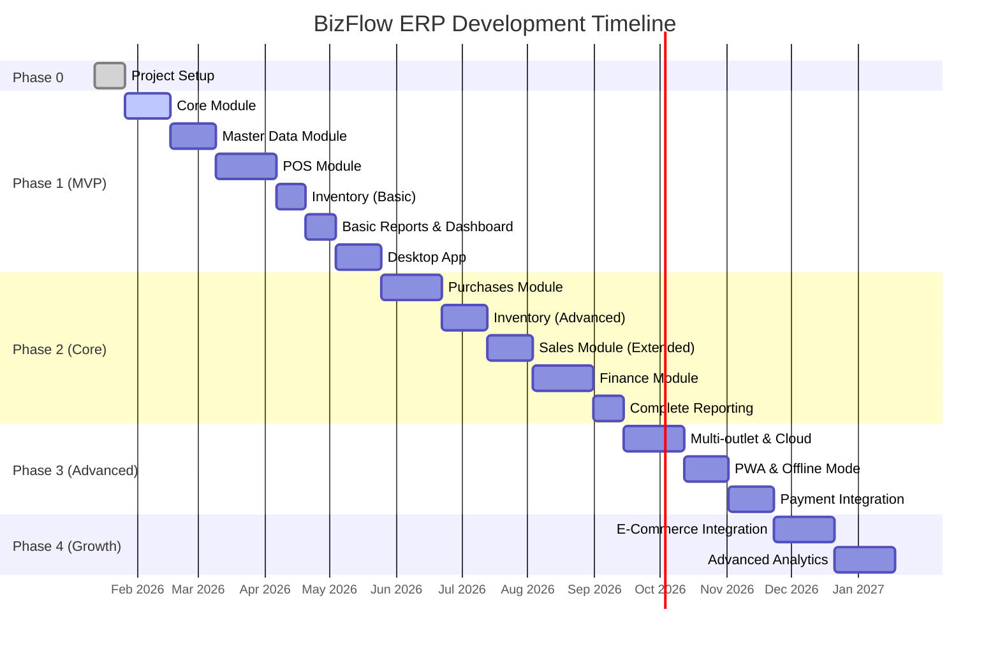

# BizFlow ERP - Project Roadmap

> Roadmap lengkap pengembangan BizFlow ERP berdasarkan dokumentasi requirements dan technical specifications.

## 📊 Project Overview

| Aspek               | Detail                                                   |
| ------------------- | -------------------------------------------------------- |
| **Nama Proyek**     | BizFlow ERP                                              |
| **Target Pengguna** | UMKM Indonesia (Retail, F&B, Distributor, Service)       |
| **Deployment**      | On-premise (Local Network, Private Cloud, Hybrid)        |
| **Platform**        | Desktop (Windows/macOS/Linux), Web Browser, Tablet (PWA) |
| **Bahasa**          | Indonesia (primary), English (fallback)                  |

---

## 🎯 Milestone Summary

---

## 📐 Phase 0 - Project Setup (2 Minggu)

**Goal**: Foundation setup untuk monorepo, database, testing, dan sistem lisensi.

### Deliverables

| Task                                                                         | Status | Owner | Est. |
| ---------------------------------------------------------------------------- | ------ | ----- | ---- |
| Setup Turborepo monorepo (`apps/api`, `apps/web`, `apps/desktop`)            | [x]    | -     | 2d   |
| Setup shared packages (`packages/types`, `packages/ui`, `packages/database`) | [x]    | -     | 2d   |
| Konfigurasi Prisma + SQLite schema                                           | [x]    | -     | 2d   |
| Setup Vitest + Playwright untuk testing                                      | [x]    | -     | 2d   |
| Setup CI/CD (GitHub Actions)                                                 | [x]    | -     | 1d   |
| Implementasi offline license system                                          | [-]    | -     | 3d   |

### Technical Requirements

- **Monorepo**: Turborepo dengan pnpm workspace
- **Database**: Prisma ORM + SQLite (dev), PostgreSQL (cloud)
- **Testing**: Vitest (unit), Playwright (E2E)
- **License**: Cryptographic validation dengan public/private key

---

## 🚀 Phase 1 - MVP (3-4 Bulan)

**Goal**: Sistem kasir fungsional dengan manajemen produk, penjualan, dan laporan dasar.

### 1.1 Core Module

> Modul inti sistem: autentikasi, user management, role & permission, audit log.

Referensi: [02-user-management.md](file:///Users/bagus/Project/personal/BizFlow/docs/user-flow/02-user-management.md)

| Task                                         | Status | Priority |
| -------------------------------------------- | ------ | -------- |
| **Auth** - Login/logout dengan password      | [x]    | High     |
| **Auth** - Login dengan PIN (quick access)   | [x]    | Medium   |
| **Auth** - Refresh token mechanism           | [x]    | High     |
| **Auth** - Password reset flow               | [x]    | Medium   |
| **Users** - CRUD User                        | [x]    | High     |
| **Users** - Profile management               | [x]    | High     |
| **Users** - Multi-outlet assignment          | [x]    | Medium   |
| **Roles** - CRUD Role                        | [x]    | High     |
| **Roles** - Permission management (granular) | [x]    | High     |
| **Outlets** - CRUD Outlet                    | [x]    | Medium   |
| **Audit Log** - Log aktivitas user           | [x]    | Medium   |
| **Settings** - App settings management       | [x]    | Medium   |

**API Endpoints**: `/api/v1/core/auth/*`, `/api/v1/core/users/*`, `/api/v1/core/roles/*`, `/api/v1/core/outlets/*`, `/api/v1/core/audit-log/*`

---

### 1.2 Master Data Module

> Data master: produk, kategori, satuan, pelanggan, gudang.

Referensi: [03-product-management.md](file:///Users/bagus/Project/personal/BizFlow/docs/user-flow/03-product-management.md)

| Task                                   | Status | Priority |
| -------------------------------------- | ------ | -------- |
| **Categories** - CRUD Kategori         | [x]    | High     |
| **Categories** - Hierarchical (nested) | [x]    | Medium   |
| **Products** - CRUD Produk             | [x]    | High     |
| **Products** - Barcode/SKU support     | [x]    | High     |
| **Products** - Product image upload    | [x]    | Low      |
| **Products** - Product variants        | [x]    | Medium   |
| **Products** - Price levels            | [x]    | Medium   |
| **Products** - Stock alert (min stock) | [x]    | High     |
| **Units** - CRUD Unit of Measure       | [x]    | High     |
| **Units** - Konversi satuan            | [x]    | Medium   |
| **Customers** - CRUD Customer          | [x]    | High     |
| **Customers** - Credit limit           | [x]    | Medium   |
| **Warehouses** - CRUD Warehouse        | [x]    | High     |

**API Endpoints**: `/api/v1/master-data/products/*`, `/api/v1/master-data/categories/*`, `/api/v1/master-data/units/*`, `/api/v1/master-data/customers/*`, `/api/v1/master-data/warehouses/*`

---

### 1.3 POS Module

> Point of Sale: transaksi kasir, pembayaran, struk.

Referensi: [01-pos.md](file:///Users/bagus/Project/personal/BizFlow/docs/user-flow/01-pos.md)

| Task                                           | Status | Priority |
| ---------------------------------------------- | ------ | -------- |
| Quick sale dengan barcode scanner              | [x]    | High     |
| Product search (nama/SKU)                      | [x]    | High     |
| Cart management (add, edit qty, remove)        | [x]    | High     |
| Multiple payment (cash, QRIS, transfer, split) | [x]    | High     |
| Customer selection                             | [x]    | Medium   |
| Hold transaction (simpan sementara)            | [x]    | Medium   |
| Discount (item, transaksi, promo)              | [x]    | Medium   |
| Print struk (thermal 58mm, 80mm)               | [x]    | High     |
| Keyboard shortcuts                             | [x]    | Medium   |
| Return/Refund processing                       | [x]    | Medium   |

**API Endpoints**: `/api/v1/pos/*`

---

### 1.4 Inventory Module (Basic)

> Stok dasar untuk mendukung POS: tracking stok, mutasi otomatis dari penjualan.

Referensi: [06-inventory-management.md](file:///Users/bagus/Project/personal/BizFlow/docs/user-flow/06-inventory-management.md)

| Task                             | Status | Priority |
| -------------------------------- | ------ | -------- |
| Stock overview per produk/lokasi | [x]    | High     |
| Auto deduct stock on sale        | [x]    | High     |
| Stock movement tracking (in/out) | [x]    | High     |
| Low stock alert                  | [x]    | Medium   |

**API Endpoints**: `/api/v1/inventory/stock/*`

---

### 1.5 Basic Reports & Dashboard

> Laporan dasar dan dashboard untuk monitoring bisnis.

Referensi: [08-reporting-analytics.md](file:///Users/bagus/Project/personal/BizFlow/docs/user-flow/08-reporting-analytics.md)

| Task                                        | Status | Priority |
| ------------------------------------------- | ------ | -------- |
| Dashboard ringkasan bisnis                  | [x]    | High     |
| Laporan penjualan (harian/mingguan/bulanan) | [x]    | High     |
| Laporan stok                                | [x]    | High     |
| Export PDF/Excel                            | [x]    | High     |

**API Endpoints**: `/api/v1/reports/dashboard/*`, `/api/v1/reports/sales/*`, `/api/v1/reports/inventory/*`

---

### 1.6 Desktop App

> Electron wrapper untuk deployment on-premise.

Referensi: [09-desktop-app.md](file:///Users/bagus/Project/personal/BizFlow/docs/user-flow/09-desktop-app.md)

| Task                                    | Status | Priority |
| --------------------------------------- | ------ | -------- |
| Electron wrapper dengan embedded server | [x]    | High     |
| System tray integration                 | [x]    | High     |
| Server lifecycle management             | [x]    | High     |
| Logs viewer (filter, export)            | [x]    | Medium   |
| Backup/Restore functionality            | [x]    | High     |
| License activation flow                 | [x]    | High     |
| One-click installer (Windows/Mac/Linux) | [x]    | High     |

**Build Output**: `BizFlow-Setup-1.0.0.exe` (~150MB)

---

## 🔧 Phase 2 - Core Features (3-4 Bulan)

**Goal**: Complete core ERP modules untuk operasional bisnis sehari-hari.

### 2.1 Purchases Module

> Pembelian: supplier, purchase order, penerimaan barang, retur.

Referensi: [05-purchase-management.md](file:///Users/bagus/Project/personal/BizFlow/docs/user-flow/05-purchase-management.md)

| Task                            | Status | Priority |
| ------------------------------- | ------ | -------- |
| **Suppliers** - CRUD Supplier   | [x]    | High     |
| **Orders** - Purchase Order     | [x]    | High     |
| **Orders** - PO status workflow | [x]    | High     |
| **Goods Receive** - Penerimaan  | [x]    | High     |
| **Returns** - Purchase Return   | [x]    | Medium   |
| **Payments** - Supplier Payment | [x]    | High     |
| Payment terms management        | [x]    | Medium   |
| Purchase history per supplier   | [x]    | High     |
| Auto-reorder (stok minimum)     | [x]    | Low      |

**API Endpoints**: `/api/v1/master-data/suppliers/*`, `/api/v1/purchases/orders/*`, `/api/v1/purchases/goods-receive/*`, `/api/v1/purchases/returns/*`, `/api/v1/purchases/payments/*`

---

### 2.2 Inventory Module (Advanced)

> Inventory lanjutan: adjustment, transfer, stock opname.

| Task                                     | Status | Priority |
| ---------------------------------------- | ------ | -------- |
| **Adjustments** - Stock correction       | [x]    | High     |
| **Adjustments** - Approval workflow      | [x]    | Medium   |
| **Transfers** - Inter-warehouse transfer | [ ]    | Medium   |
| **Transfers** - Transfer status workflow | [ ]    | Medium   |
| **Opname** - Stock counting              | [ ]    | High     |
| **Opname** - Finalization & adjustment   | [ ]    | High     |
| Batch/Lot tracking                       | [ ]    | Low      |
| Expiry date tracking                     | [ ]    | Medium   |
| Stock valuation (HPP)                    | [ ]    | High     |

**API Endpoints**: `/api/v1/inventory/adjustments/*`, `/api/v1/inventory/transfers/*`, `/api/v1/inventory/opname/*`

---

### 2.3 Sales Module (Extended)

> Sales order, delivery, retur, kredit pelanggan.

Referensi: [04-sales-management.md](file:///Users/bagus/Project/personal/BizFlow/docs/user-flow/04-sales-management.md)

| Task                            | Status | Priority |
| ------------------------------- | ------ | -------- |
| **Orders** - Sales Order        | [ ]    | High     |
| **Orders** - Invoice            | [ ]    | High     |
| **Orders** - Delivery Order     | [ ]    | Medium   |
| **Returns** - Sales Return      | [ ]    | Medium   |
| **Payments** - Customer Payment | [ ]    | High     |
| Quotation (penawaran harga)     | [ ]    | Low      |
| Sales history per customer      | [ ]    | High     |

**API Endpoints**: `/api/v1/sales/orders/*`, `/api/v1/sales/returns/*`, `/api/v1/sales/payments/*`

---

### 2.4 Finance Module

> Keuangan: kas, bank, transaksi, pengeluaran.

Referensi: [07-cash-bank-management.md](file:///Users/bagus/Project/personal/BizFlow/docs/user-flow/07-cash-bank-management.md)

| Task                               | Status | Priority |
| ---------------------------------- | ------ | -------- |
| **Accounts** - Multi rekening bank | [ ]    | High     |
| **Accounts** - Kas kecil           | [ ]    | High     |
| **Transactions** - Payment In      | [ ]    | High     |
| **Transactions** - Payment Out     | [ ]    | High     |
| **Transactions** - Bank transfer   | [ ]    | Medium   |
| **Expenses** - Expense categories  | [ ]    | High     |
| Bank reconciliation                | [ ]    | Medium   |
| Receipt/Payment voucher            | [ ]    | Medium   |
| AR/AP - Piutang pelanggan          | [ ]    | High     |
| AR/AP - Hutang supplier            | [ ]    | High     |
| AR/AP - Aging report               | [ ]    | Medium   |

**API Endpoints**: `/api/v1/finance/accounts/*`, `/api/v1/finance/transactions/*`, `/api/v1/finance/expenses/*`

---

### 2.5 Complete Reporting

> Laporan lengkap: pembelian, inventory, keuangan.

| Task                           | Status | Priority |
| ------------------------------ | ------ | -------- |
| Laporan pembelian              | [ ]    | High     |
| Laporan inventory & mutasi     | [ ]    | High     |
| Laporan laba rugi (P&L)        | [ ]    | High     |
| Laporan arus kas (Cash Flow)   | [ ]    | High     |
| Laporan AR/AP                  | [ ]    | High     |
| Product analysis (best seller) | [ ]    | Medium   |
| Customer analysis              | [ ]    | Medium   |

**API Endpoints**: `/api/v1/reports/purchases/*`, `/api/v1/reports/financial/*`

---

## ⚡ Phase 3 - Advanced Features (2-3 Bulan)

**Goal**: Fitur lanjutan untuk skalabilitas dan integrasi.

### 3.1 Multi-outlet (Option B/C)

| Task                             | Status | Priority |
| -------------------------------- | ------ | -------- |
| Docker deployment setup          | [ ]    | High     |
| PostgreSQL migration dari SQLite | [ ]    | High     |
| Central management dashboard     | [ ]    | High     |
| Per-outlet access control        | [ ]    | High     |
| Inter-outlet stock transfer      | [ ]    | Medium   |

---

### 3.2 PWA & Offline Mode

| Task                          | Status | Priority |
| ----------------------------- | ------ | -------- |
| Service Worker implementation | [ ]    | High     |
| Offline-first architecture    | [ ]    | High     |
| Background sync               | [ ]    | High     |
| IndexedDB local storage       | [ ]    | Medium   |

---

### 3.3 Payment Integration

| Task                               | Status | Priority |
| ---------------------------------- | ------ | -------- |
| QRIS integration (Midtrans/Xendit) | [ ]    | High     |
| Virtual Account support            | [ ]    | Medium   |
| Split payment enhancement          | [ ]    | Medium   |

---

## 📈 Phase 4 - Growth (Ongoing)

**Goal**: Ekspansi fitur dan integrasi ekosistem.

### 4.1 E-Commerce Integration

| Task                       | Status | Priority |
| -------------------------- | ------ | -------- |
| Tokopedia marketplace sync | [ ]    | Medium   |
| Shopee marketplace sync    | [ ]    | Medium   |
| TikTok Shop integration    | [ ]    | Low      |
| Unified order management   | [ ]    | Medium   |

---

### 4.2 Advanced Analytics

| Task                         | Status | Priority |
| ---------------------------- | ------ | -------- |
| Advanced business dashboard  | [ ]    | Medium   |
| Trend analysis & forecasting | [ ]    | Low      |
| Custom report builder        | [ ]    | Low      |

---

### 4.3 API & Extensibility

| Task                       | Status | Priority |
| -------------------------- | ------ | -------- |
| Public API for third-party | [ ]    | Low      |
| Webhook support            | [ ]    | Low      |
| Plugin architecture        | [ ]    | Low      |

---

## 📚 Documentation Reference

### User Flow Documents

| Module                | Document                                                                                                             |
| --------------------- | -------------------------------------------------------------------------------------------------------------------- |
| Point of Sale         | [01-pos.md](file:///Users/bagus/Project/personal/BizFlow/docs/user-flow/01-pos.md)                                   |
| User Management       | [02-user-management.md](file:///Users/bagus/Project/personal/BizFlow/docs/user-flow/02-user-management.md)           |
| Product Management    | [03-product-management.md](file:///Users/bagus/Project/personal/BizFlow/docs/user-flow/03-product-management.md)     |
| Sales Management      | [04-sales-management.md](file:///Users/bagus/Project/personal/BizFlow/docs/user-flow/04-sales-management.md)         |
| Purchase Management   | [05-purchase-management.md](file:///Users/bagus/Project/personal/BizFlow/docs/user-flow/05-purchase-management.md)   |
| Inventory Management  | [06-inventory-management.md](file:///Users/bagus/Project/personal/BizFlow/docs/user-flow/06-inventory-management.md) |
| Cash & Bank           | [07-cash-bank-management.md](file:///Users/bagus/Project/personal/BizFlow/docs/user-flow/07-cash-bank-management.md) |
| Reporting & Analytics | [08-reporting-analytics.md](file:///Users/bagus/Project/personal/BizFlow/docs/user-flow/08-reporting-analytics.md)   |
| Desktop App           | [09-desktop-app.md](file:///Users/bagus/Project/personal/BizFlow/docs/user-flow/09-desktop-app.md)                   |
| License Management    | [10-license-management.md](file:///Users/bagus/Project/personal/BizFlow/docs/user-flow/10-license-management.md)     |

### Technical Specifications

| Document                                                                                                                         | Description                             |
| -------------------------------------------------------------------------------------------------------------------------------- | --------------------------------------- |
| [01-architecture.md](file:///Users/bagus/Project/personal/BizFlow/docs/technical-specs/01-architecture.md)                       | System architecture, monorepo structure |
| [02-database-schema.md](file:///Users/bagus/Project/personal/BizFlow/docs/technical-specs/02-database-schema.md)                 | Prisma schema, ERD, table definitions   |
| [03-api-specifications.md](file:///Users/bagus/Project/personal/BizFlow/docs/technical-specs/03-api-specifications.md)           | RESTful API design, endpoints           |
| [04-frontend-specifications.md](file:///Users/bagus/Project/personal/BizFlow/docs/technical-specs/04-frontend-specifications.md) | Page routes, state management           |
| [05-security.md](file:///Users/bagus/Project/personal/BizFlow/docs/technical-specs/05-security.md)                               | Authentication, authorization           |
| [06-hardware-integration.md](file:///Users/bagus/Project/personal/BizFlow/docs/technical-specs/06-hardware-integration.md)       | Printer, barcode scanner                |
| [07-deployment.md](file:///Users/bagus/Project/personal/BizFlow/docs/technical-specs/07-deployment.md)                           | Electron, Docker setup                  |
| [08-testing.md](file:///Users/bagus/Project/personal/BizFlow/docs/technical-specs/08-testing.md)                                 | Test strategy                           |
| [09-performance.md](file:///Users/bagus/Project/personal/BizFlow/docs/technical-specs/09-performance.md)                         | Response time targets                   |

---

## 💰 Licensing Model

| Paket          | Harga          | Fitur                          |
| -------------- | -------------- | ------------------------------ |
| **Starter**    | Rp 2.500.000   | 1 outlet, 3 user, fitur dasar  |
| **Business**   | Rp 7.500.000   | 5 outlet, 20 user, semua fitur |
| **Enterprise** | Rp 15.000.000+ | Unlimited, custom, source code |

---

## ✅ Status Legend

| Status | Description                     |
| ------ | ------------------------------- |
| `[ ]`  | TODO - Belum dimulai            |
| `[/]`  | IN PROGRESS - Sedang dikerjakan |
| `[x]`  | DONE - Selesai                  |
| `[-]`  | ON HOLD - Ditunda               |
| `[~]`  | CANCELLED - Dibatalkan          |

---

_Last updated: 2026-02-06_
