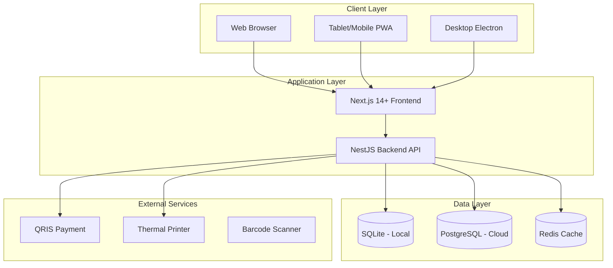

# System Architecture

## High-Level Architecture



---

## Monorepo Structure

```
bizflow/
├── apps/
│   ├── desktop/                    # Electron wrapper
│   │   ├── src/
│   │   │   ├── main/               # Main process
│   │   │   │   ├── index.ts
│   │   │   │   ├── server.ts       # Server lifecycle
│   │   │   │   ├── tray.ts         # System tray
│   │   │   │   └── windows.ts      # Window management
│   │   │   └── preload/
│   │   └── electron-builder.yml
│   │
│   ├── api/                        # NestJS backend
│   │   ├── src/
│   │   │   ├── modules/
│   │   │   │   │
│   │   │   │   ├── core/           # Core System Modules
│   │   │   │   │   ├── auth/       # Authentication (login, refresh, PIN)
│   │   │   │   │   ├── users/      # User management
│   │   │   │   │   ├── roles/      # Role & Permission management
│   │   │   │   │   ├── audit-log/  # Audit logging
│   │   │   │   │   ├── outlets/    # Outlet/Branch management
│   │   │   │   │   └── license/    # License management
│   │   │   │   │
│   │   │   │   ├── master-data/    # Master Data Modules
│   │   │   │   │   ├── products/   # Product & ProductVariant
│   │   │   │   │   ├── categories/ # Product categories (hierarchical)
│   │   │   │   │   ├── units/      # UnitOfMeasure
│   │   │   │   │   ├── customers/  # Customer management
│   │   │   │   │   ├── suppliers/  # Supplier management
│   │   │   │   │   └── warehouses/ # Warehouse & Locations
│   │   │   │   │
│   │   │   │   ├── inventory/      # Inventory Management
│   │   │   │   │   ├── stock/      # Stock & StockMovement
│   │   │   │   │   ├── adjustments/# StockAdjustment
│   │   │   │   │   ├── transfers/  # StockTransfer
│   │   │   │   │   ├── opname/     # StockOpname (stock counting)
│   │   │   │   │   └── goods-receive/ # GoodsReceive from purchases
│   │   │   │   │
│   │   │   │   ├── sales/          # Sales Modules
│   │   │   │   │   ├── orders/     # SalesOrder management
│   │   │   │   │   ├── returns/    # SalesReturn
│   │   │   │   │   ├── payments/   # Customer Payments
│   │   │   │   │   └── price-levels/ # PriceLevel management
│   │   │   │   │
│   │   │   │   ├── purchases/      # Purchase Modules
│   │   │   │   │   ├── orders/     # PurchaseOrder management
│   │   │   │   │   ├── returns/    # PurchaseReturn
│   │   │   │   │   └── payments/   # SupplierPayment
│   │   │   │   │
│   │   │   │   ├── pos/            # Point of Sale
│   │   │   │   │   └── transactions/ # POS transactions
│   │   │   │   │
│   │   │   │   ├── finance/        # Financial Modules
│   │   │   │   │   ├── accounts/   # Account management
│   │   │   │   │   ├── transactions/ # Financial transactions
│   │   │   │   │   └── expenses/   # ExpenseCategory & expenses
│   │   │   │   │
│   │   │   │   ├── reports/        # Reporting & Analytics
│   │   │   │   │   ├── sales/      # Sales reports
│   │   │   │   │   ├── inventory/  # Inventory reports
│   │   │   │   │   ├── financial/  # Financial reports (P&L, etc)
│   │   │   │   │   └── dashboards/ # Dashboard aggregations
│   │   │   │   │
│   │   │   │   └── settings/       # System Settings
│   │   │   │       └── general/    # App settings, preferences
│   │   │   │
│   │   │   ├── common/
│   │   │   │   ├── guards/
│   │   │   │   ├── interceptors/
│   │   │   │   ├── decorators/
│   │   │   │   └── filters/
│   │   │   └── main.ts
│   │   └── test/
│   │
│   └── web/                        # Next.js frontend
│       ├── app/
│       │   ├── (auth)/             # /login, /forgot-password
│       │   ├── (dashboard)/        # Main dashboard layout
│       │   │   ├── dashboard/      # / (homepage)
│       │   │   │
│       │   │   ├── pos/            # /pos (full-screen POS interface)
│       │   │   │
│       │   │   ├── master-data/    # Master Data Pages
│       │   │   │   ├── products/   # /master-data/products
│       │   │   │   ├── categories/ # /master-data/categories
│       │   │   │   ├── customers/  # /master-data/customers
│       │   │   │   ├── suppliers/  # /master-data/suppliers
│       │   │   │   └── warehouses/ # /master-data/warehouses
│       │   │   │
│       │   │   ├── inventory/      # Inventory Pages
│       │   │   │   ├── stock/      # /inventory/stock
│       │   │   │   ├── adjustments/# /inventory/adjustments
│       │   │   │   ├── transfers/  # /inventory/transfers
│       │   │   │   └── opname/     # /inventory/opname
│       │   │   │
│       │   │   ├── sales/          # Sales Pages
│       │   │   │   ├── orders/     # /sales/orders
│       │   │   │   ├── returns/    # /sales/returns
│       │   │   │   └── payments/   # /sales/payments
│       │   │   │
│       │   │   ├── purchases/      # Purchase Pages
│       │   │   │   ├── orders/     # /purchases/orders
│       │   │   │   ├── goods-receive/ # /purchases/goods-receive
│       │   │   │   ├── returns/    # /purchases/returns
│       │   │   │   └── payments/   # /purchases/payments
│       │   │   │
│       │   │   ├── finance/        # Finance Pages
│       │   │   │   ├── accounts/   # /finance/accounts
│       │   │   │   ├── transactions/ # /finance/transactions
│       │   │   │   └── expenses/   # /finance/expenses
│       │   │   │
│       │   │   ├── reports/        # Report Pages
│       │   │   │   ├── sales/      # /reports/sales
│       │   │   │   ├── inventory/  # /reports/inventory
│       │   │   │   └── financial/  # /reports/financial
│       │   │   │
│       │   │   └── settings/       # Settings Pages
│       │   │       ├── general/    # /settings/general
│       │   │       ├── users/      # /settings/users
│       │   │       ├── roles/      # /settings/roles
│       │   │       └── outlets/    # /settings/outlets
│       │   │
│       │   └── layout.tsx
│       ├── components/
│       │   ├── layout/             # Layout components (sidebar, header)
│       │   ├── shared/             # Shared UI components
│       │   └── [feature]/          # Feature-specific components
│       ├── hooks/
│       ├── services/
│       └── stores/
│
├── packages/
│   ├── types/                      # Shared TypeScript types
│   │   ├── src/
│   │   │   ├── entities/
│   │   │   ├── dto/
│   │   │   └── enums/
│   │   └── package.json
│   │
│   ├── ui/                         # Shared UI components
│   │   ├── src/
│   │   │   ├── components/
│   │   │   └── styles/
│   │   └── package.json
│   │
│   ├── database/                   # Prisma schema & migrations
│   │   ├── prisma/
│   │   │   ├── schema.prisma
│   │   │   └── migrations/
│   │   └── package.json
│   │
│   └── license/                    # License validation module
│       ├── src/
│       │   ├── generator.ts        # CLI tool (private)
│       │   └── validator.ts        # App validator (public key)
│       └── package.json
│
├── tools/
│   └── plop/                       # Code generators
│       ├── plopfile.js
│       └── templates/
│
├── turbo.json
├── package.json
└── pnpm-workspace.yaml
```

---

## Core Technologies

| Layer          | Teknologi                | Alasan                             |
| -------------- | ------------------------ | ---------------------------------- |
| **Language**   | TypeScript               | Type-safe, better DX               |
| **Backend**    | NestJS                   | Modular, enterprise-ready          |
| **Frontend**   | Next.js 14+              | SSR/SSG, React ecosystem           |
| **UI**         | Shadcn/UI + Tailwind     | Modern, customizable               |
| **ORM**        | Prisma                   | Type-safe, auto-migration          |
| **Validation** | Zod                      | Schema validation + type inference |
| **State**      | Zustand + TanStack Query | Simple, powerful                   |
| **Auth**       | JWT + Refresh Token      | Stateless, secure                  |

## Development Tools

| Kategori      | Tool                | Fungsi                                      |
| ------------- | ------------------- | ------------------------------------------- |
| **Monorepo**  | Turborepo           | Manage frontend + backend dalam 1 repo      |
| **API Docs**  | Swagger/OpenAPI     | Auto-generate API documentation             |
| **Testing**   | Vitest + Playwright | Unit test + E2E browser testing             |
| **Code Gen**  | Plop.js             | Scaffold module/entity baru dengan template |
| **Dev Tools** | Prisma Studio       | GUI untuk browse/edit database              |
| **i18n**      | i18next             | Multi-language support (ID/EN)              |
| **Linting**   | ESLint + Prettier   | Code quality & formatting                   |

---

## Module Overview

### Core Modules

| Module             | API Endpoints                            | Database Models    |
| ------------------ | ---------------------------------------- | ------------------ |
| **core/auth**      | `/api/v1/auth/*`                         | User, AuditLog     |
| **core/users**     | `/api/v1/users/*`                        | User, UserOutlet   |
| **core/roles**     | `/api/v1/roles/*`, `/api/v1/permissions` | Role, Permission   |
| **core/audit-log** | `/api/v1/audit-log/*`                    | AuditLog           |
| **core/outlets**   | `/api/v1/outlets/*`                      | Outlet, UserOutlet |
| **core/license**   | `/api/v1/license/*`                      | License            |

### Master Data Modules

| Module                     | API Endpoints          | Database Models                     |
| -------------------------- | ---------------------- | ----------------------------------- |
| **master-data/products**   | `/api/v1/products/*`   | Product, ProductVariant, PriceLevel |
| **master-data/categories** | `/api/v1/categories/*` | Category                            |
| **master-data/units**      | `/api/v1/units/*`      | UnitOfMeasure                       |
| **master-data/customers**  | `/api/v1/customers/*`  | Customer                            |
| **master-data/suppliers**  | `/api/v1/suppliers/*`  | Supplier                            |
| **master-data/warehouses** | `/api/v1/warehouses/*` | Warehouse                           |

### Operational Modules

| Module                      | API Endpoints                       | Database Models                      |
| --------------------------- | ----------------------------------- | ------------------------------------ |
| **inventory/stock**         | `/api/v1/inventory/stock/*`         | Stock, StockMovement                 |
| **inventory/adjustments**   | `/api/v1/inventory/adjustments/*`   | StockAdjustment, StockAdjustmentItem |
| **inventory/transfers**     | `/api/v1/inventory/transfers/*`     | StockTransfer, StockTransferItem     |
| **inventory/opname**        | `/api/v1/inventory/opname/*`        | StockOpname, StockOpnameItem         |
| **inventory/goods-receive** | `/api/v1/inventory/goods-receive/*` | GoodsReceive, GoodsReceiveItem       |
| **sales/orders**            | `/api/v1/sales/orders/*`            | SalesOrder, SalesOrderItem           |
| **sales/returns**           | `/api/v1/sales/returns/*`           | SalesReturn, SalesReturnItem         |
| **sales/payments**          | `/api/v1/sales/payments/*`          | Payment                              |
| **purchases/orders**        | `/api/v1/purchases/orders/*`        | PurchaseOrder, PurchaseOrderItem     |
| **purchases/returns**       | `/api/v1/purchases/returns/*`       | PurchaseReturn, PurchaseReturnItem   |
| **purchases/payments**      | `/api/v1/purchases/payments/*`      | SupplierPayment                      |
| **pos/transactions**        | `/api/v1/pos/*`                     | SalesOrder, SalesOrderItem, Payment  |

### Finance & Reporting Modules

| Module                   | API Endpoints                    | Database Models                   |
| ------------------------ | -------------------------------- | --------------------------------- |
| **finance/accounts**     | `/api/v1/finance/accounts/*`     | Account                           |
| **finance/transactions** | `/api/v1/finance/transactions/*` | Transaction                       |
| **finance/expenses**     | `/api/v1/finance/expenses/*`     | ExpenseCategory                   |
| **reports/sales**        | `/api/v1/reports/sales/*`        | (Aggregates SalesOrder, Payment)  |
| **reports/inventory**    | `/api/v1/reports/inventory/*`    | (Aggregates Stock, StockMovement) |
| **reports/financial**    | `/api/v1/reports/financial/*`    | (Aggregates Transaction, P&L)     |
| **reports/dashboards**   | `/api/v1/reports/dashboard/*`    | (Aggregates all modules)          |
| **settings/general**     | `/api/v1/settings/*`             | AppSettings (config)              |
