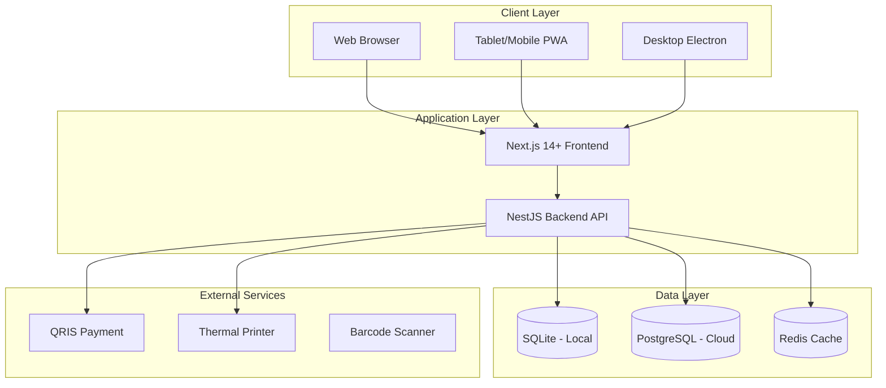

# System Architecture

## High-Level Architecture



---

## Monorepo Structure

```
bizflow/
├── apps/
│   ├── desktop/              # Electron wrapper
│   │   ├── src/
│   │   │   ├── main/         # Main process
│   │   │   │   ├── index.ts
│   │   │   │   ├── server.ts   # Server lifecycle
│   │   │   │   ├── tray.ts     # System tray
│   │   │   │   └── windows.ts  # Window management
│   │   │   └── preload/
│   │   └── electron-builder.yml
│   │
│   ├── api/                  # NestJS backend
│   │   ├── src/
│   │   │   ├── modules/
│   │   │   │   ├── auth/       # Authentication (login, refresh, PIN)
│   │   │   │   ├── users/      # User & role management
│   │   │   │   ├── products/   # Products, categories, units
│   │   │   │   ├── pos/        # Point of Sale transactions
│   │   │   │   ├── sales/      # Sales orders, customers, returns
│   │   │   │   ├── purchases/  # Purchase orders, suppliers, goods receive
│   │   │   │   ├── inventory/  # Stock, adjustments, transfers, opname, warehouses
│   │   │   │   ├── finance/    # Accounts, transactions, AR/AP, expense categories
│   │   │   │   ├── reports/    # Dashboard, sales, purchases, inventory, P&L reports
│   │   │   │   └── settings/   # Company, outlets, printer, backup/restore
│   │   │   ├── common/
│   │   │   │   ├── guards/
│   │   │   │   ├── interceptors/
│   │   │   │   ├── decorators/
│   │   │   │   └── filters/
│   │   │   └── main.ts
│   │   └── test/
│   │
│   └── web/                  # Next.js frontend
│       ├── app/
│       │   ├── (auth)/         # /login, /forgot-password
│       │   ├── (dashboard)/    # Main dashboard layout
│       │   │   ├── pos/        # /pos, /pos/transactions, /pos/returns
│       │   │   ├── products/   # /products, /products/categories, /products/units
│       │   │   ├── sales/      # /sales/orders, /sales/customers, /sales/returns
│       │   │   ├── purchases/  # /purchases/orders, /purchases/suppliers, /purchases/receive
│       │   │   ├── inventory/  # /inventory, /inventory/adjustments, /inventory/transfers, /inventory/opname, /inventory/warehouses
│       │   │   ├── finance/    # /finance/accounts, /finance/transactions, /finance/receivables, /finance/payables
│       │   │   ├── reports/    # /reports, /reports/sales, /reports/purchases, /reports/inventory, /reports/profit-loss
│       │   │   └── settings/   # /settings/users, /settings/roles, /settings/outlets, /settings/company
│       │   └── layout.tsx
│       ├── components/
│       ├── hooks/
│       ├── services/
│       └── stores/
│
├── packages/
│   ├── types/                # Shared TypeScript types
│   │   ├── src/
│   │   │   ├── entities/
│   │   │   ├── dto/
│   │   │   └── enums/
│   │   └── package.json
│   │
│   ├── ui/                   # Shared UI components
│   │   ├── src/
│   │   │   ├── components/
│   │   │   └── styles/
│   │   └── package.json
│   │
│   ├── database/             # Prisma schema & migrations
│   │   ├── prisma/
│   │   │   ├── schema.prisma
│   │   │   └── migrations/
│   │   └── package.json
│   │
│   └── license/              # License validation module
│       ├── src/
│       │   ├── generator.ts    # CLI tool (private)
│       │   └── validator.ts    # App validator (public key)
│       └── package.json
│
├── tools/
│   └── plop/                 # Code generators
│       ├── plopfile.js
│       └── templates/
│
├── turbo.json
├── package.json
└── pnpm-workspace.yaml
```

---

## Core Technologies

| Layer          | Teknologi                | Alasan                             |
| -------------- | ------------------------ | ---------------------------------- |
| **Language**   | TypeScript               | Type-safe, better DX               |
| **Backend**    | NestJS                   | Modular, enterprise-ready          |
| **Frontend**   | Next.js 14+              | SSR/SSG, React ecosystem           |
| **UI**         | Shadcn/UI + Tailwind     | Modern, customizable               |
| **ORM**        | Prisma                   | Type-safe, auto-migration          |
| **Validation** | Zod                      | Schema validation + type inference |
| **State**      | Zustand + TanStack Query | Simple, powerful                   |
| **Auth**       | JWT + Refresh Token      | Stateless, secure                  |

## Development Tools

| Kategori      | Tool                | Fungsi                                      |
| ------------- | ------------------- | ------------------------------------------- |
| **Monorepo**  | Turborepo           | Manage frontend + backend dalam 1 repo      |
| **API Docs**  | Swagger/OpenAPI     | Auto-generate API documentation             |
| **Testing**   | Vitest + Playwright | Unit test + E2E browser testing             |
| **Code Gen**  | Plop.js             | Scaffold module/entity baru dengan template |
| **Dev Tools** | Prisma Studio       | GUI untuk browse/edit database              |
| **i18n**      | i18next             | Multi-language support (ID/EN)              |
| **Linting**   | ESLint + Prettier   | Code quality & formatting                   |

---

## Module Overview

| Module        | API Endpoints                                                   | Database Models                                                              |
| ------------- | --------------------------------------------------------------- | ---------------------------------------------------------------------------- |
| **auth**      | `/api/v1/auth/*`                                                | User, AuditLog                                                               |
| **users**     | `/api/v1/users/*`, `/api/v1/roles/*`, `/api/v1/permissions`     | User, Role, Permission, AuditLog                                             |
| **products**  | `/api/v1/products/*`, `/api/v1/categories/*`, `/api/v1/units/*` | Product, ProductVariant, Category, UnitOfMeasure, PriceLevel                 |
| **pos**       | `/api/v1/pos/*`                                                 | SalesOrder, SalesOrderItem, Payment                                          |
| **sales**     | `/api/v1/sales/*`, `/api/v1/customers/*`                        | Customer, SalesOrder, SalesOrderItem, SalesReturn, SalesReturnItem, Payment  |
| **purchases** | `/api/v1/purchases/*`, `/api/v1/suppliers/*`                    | Supplier, PurchaseOrder, PurchaseOrderItem, GoodsReceive, PurchaseReturn     |
| **inventory** | `/api/v1/inventory/*`, `/api/v1/warehouses/*`                   | Warehouse, Stock, StockMovement, StockAdjustment, StockTransfer, StockOpname |
| **finance**   | `/api/v1/finance/*`                                             | Account, Transaction, ExpenseCategory, Payment, SupplierPayment              |
| **reports**   | `/api/v1/reports/*`                                             | (Aggregates data from all modules)                                           |
| **settings**  | `/api/v1/settings/*`                                            | Outlet, CompanySettings (config)                                             |
