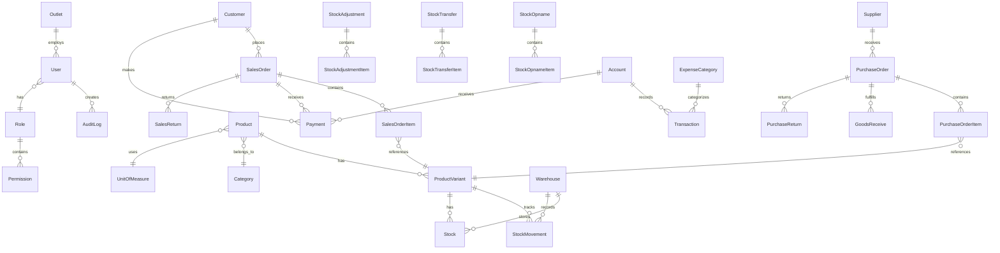

# Database Schema

## Entity Relationship Diagram



---

## Core Entities

### Outlet

```prisma
model Outlet {
  id          String    @id @default(cuid())
  code        String    @unique
  name        String
  address     String?
  phone       String?
  isActive    Boolean   @default(true)
  createdAt   DateTime  @default(now())
  updatedAt   DateTime  @updatedAt

  salesOrders SalesOrder[]

  @@index([code])
}
```

---

## Users & Access

```prisma
model User {
  id            String    @id @default(cuid())
  username      String    @unique
  email         String?   @unique
  password      String    // bcrypt hashed
  pin           String?   // 4-6 digit PIN for quick access
  name          String
  roleId        String
  outletIds     String[]  // Multi-outlet access
  isActive      Boolean   @default(true)
  lastLogin     DateTime?
  createdAt     DateTime  @default(now())
  updatedAt     DateTime  @updatedAt

  role          Role      @relation(fields: [roleId], references: [id])
  auditLogs     AuditLog[]
  salesOrders   SalesOrder[]

  @@index([username])
  @@index([roleId])
}

model Role {
  id          String       @id @default(cuid())
  name        String       @unique // owner, admin, kasir, gudang
  description String?
  permissions Permission[]
  users       User[]
  createdAt   DateTime     @default(now())
  updatedAt   DateTime     @updatedAt
}

model Permission {
  id       String   @id @default(cuid())
  module   String   // pos, products, sales, etc.
  action   String   // create, read, update, delete
  roleId   String

  role     Role     @relation(fields: [roleId], references: [id])

  @@unique([roleId, module, action])
}

model AuditLog {
  id          String   @id @default(cuid())
  userId      String
  action      String   // login, create, update, delete
  module      String
  entityId    String?
  entityType  String?
  oldValue    Json?
  newValue    Json?
  ipAddress   String?
  userAgent   String?
  createdAt   DateTime @default(now())

  user        User     @relation(fields: [userId], references: [id])

  @@index([userId])
  @@index([module])
  @@index([createdAt])
}
```

---

## Products & Inventory

```prisma
model Category {
  id          String     @id @default(cuid())
  name        String
  parentId    String?
  description String?
  isActive    Boolean    @default(true)
  createdAt   DateTime   @default(now())
  updatedAt   DateTime   @updatedAt

  parent      Category?  @relation("CategoryHierarchy", fields: [parentId], references: [id])
  children    Category[] @relation("CategoryHierarchy")
  products    Product[]

  @@index([parentId])
}

model UnitOfMeasure {
  id           String    @id @default(cuid())
  name         String    // pcs, kg, liter, box
  symbol       String    // pcs, kg, L, box
  baseUnitId   String?   // For conversions
  conversionRate Float?  // 1 box = 12 pcs → rate = 12
  createdAt    DateTime  @default(now())

  baseUnit     UnitOfMeasure?  @relation("UnitConversion", fields: [baseUnitId], references: [id])
  derivedUnits UnitOfMeasure[] @relation("UnitConversion")
  products     Product[]
}

model Product {
  id           String    @id @default(cuid())
  sku          String    @unique
  barcode      String?   @unique
  name         String
  description  String?
  categoryId   String
  unitId       String
  costPrice    Decimal   @db.Decimal(15, 2)
  sellPrice    Decimal   @db.Decimal(15, 2)
  minStock     Int       @default(0)
  isActive     Boolean   @default(true)
  isService    Boolean   @default(false)
  imageUrl     String?
  createdAt    DateTime  @default(now())
  updatedAt    DateTime  @updatedAt

  category     Category  @relation(fields: [categoryId], references: [id])
  unit         UnitOfMeasure @relation(fields: [unitId], references: [id])
  variants     ProductVariant[]
  priceLevels  PriceLevel[]

  @@index([sku])
  @@index([barcode])
  @@index([categoryId])
  @@index([name])
}

model ProductVariant {
  id            String    @id @default(cuid())
  productId     String
  sku           String    @unique
  barcode       String?   @unique
  name          String    // "Merah - XL"
  attributes    Json      // { "color": "merah", "size": "XL" }
  costPrice     Decimal   @db.Decimal(15, 2)
  sellPrice     Decimal   @db.Decimal(15, 2)
  isActive      Boolean   @default(true)
  createdAt     DateTime  @default(now())
  updatedAt     DateTime  @updatedAt

  product       Product   @relation(fields: [productId], references: [id])
  stocks        Stock[]
  stockMovements StockMovement[]
  salesOrderItems SalesOrderItem[]
  purchaseOrderItems PurchaseOrderItem[]

  @@index([productId])
  @@index([sku])
  @@index([barcode])
}

model PriceLevel {
  id          String   @id @default(cuid())
  productId   String
  name        String   // retail, grosir, member
  minQty      Int      @default(1)
  price       Decimal  @db.Decimal(15, 2)

  product     Product  @relation(fields: [productId], references: [id])

  @@unique([productId, name])
}

model Warehouse {
  id          String    @id @default(cuid())
  code        String    @unique
  name        String
  address     String?
  isDefault   Boolean   @default(false)
  isActive    Boolean   @default(true)
  createdAt   DateTime  @default(now())
  updatedAt   DateTime  @updatedAt

  stocks      Stock[]
  stockMovements StockMovement[]
  stockAdjustments StockAdjustment[]
  stockOpnames StockOpname[]
  transfersFrom StockTransfer[] @relation("TransferFrom")
  transfersTo StockTransfer[] @relation("TransferTo")
  goodsReceives GoodsReceive[]
}

model Stock {
  id            String   @id @default(cuid())
  variantId     String
  warehouseId   String
  quantity      Decimal  @db.Decimal(15, 4)
  reservedQty   Decimal  @db.Decimal(15, 4) @default(0)
  updatedAt     DateTime @updatedAt

  variant       ProductVariant @relation(fields: [variantId], references: [id])
  warehouse     Warehouse @relation(fields: [warehouseId], references: [id])

  @@unique([variantId, warehouseId])
  @@index([warehouseId])
}

model StockMovement {
  id            String    @id @default(cuid())
  variantId     String
  warehouseId   String
  type          String    // in, out, adjustment, transfer
  quantity      Decimal   @db.Decimal(15, 4)
  referenceType String?   // sales_order, purchase_order, adjustment, transfer, opname
  referenceId   String?
  notes         String?
  createdAt     DateTime  @default(now())
  createdBy     String

  variant       ProductVariant @relation(fields: [variantId], references: [id])
  warehouse     Warehouse @relation(fields: [warehouseId], references: [id])

  @@index([variantId])
  @@index([warehouseId])
  @@index([createdAt])
  @@index([referenceType, referenceId])
}
```

---

## Inventory Operations

```prisma
model StockAdjustment {
  id            String    @id @default(cuid())
  adjustmentNumber String  @unique
  warehouseId   String
  type          String    // increase, decrease, correction
  reason        String
  status        String    @default("draft") // draft, approved, cancelled
  notes         String?
  approvedBy    String?
  approvedAt    DateTime?
  createdBy     String
  createdAt     DateTime  @default(now())
  updatedAt     DateTime  @updatedAt

  warehouse     Warehouse @relation(fields: [warehouseId], references: [id])
  items         StockAdjustmentItem[]

  @@index([warehouseId])
  @@index([status])
  @@index([createdAt])
}

model StockAdjustmentItem {
  id            String    @id @default(cuid())
  adjustmentId  String
  variantId     String
  systemQty     Decimal   @db.Decimal(15, 4) // Qty before adjustment
  adjustmentQty Decimal   @db.Decimal(15, 4) // + or - quantity
  notes         String?

  adjustment    StockAdjustment @relation(fields: [adjustmentId], references: [id])

  @@index([adjustmentId])
}

model StockTransfer {
  id              String    @id @default(cuid())
  transferNumber  String    @unique
  fromWarehouseId String
  toWarehouseId   String
  status          String    @default("draft") // draft, sent, received, cancelled
  notes           String?
  sentBy          String?
  sentAt          DateTime?
  receivedBy      String?
  receivedAt      DateTime?
  createdBy       String
  createdAt       DateTime  @default(now())
  updatedAt       DateTime  @updatedAt

  fromWarehouse   Warehouse @relation("TransferFrom", fields: [fromWarehouseId], references: [id])
  toWarehouse     Warehouse @relation("TransferTo", fields: [toWarehouseId], references: [id])
  items           StockTransferItem[]

  @@index([fromWarehouseId])
  @@index([toWarehouseId])
  @@index([status])
}

model StockTransferItem {
  id            String    @id @default(cuid())
  transferId    String
  variantId     String
  requestedQty  Decimal   @db.Decimal(15, 4)
  sentQty       Decimal   @db.Decimal(15, 4) @default(0)
  receivedQty   Decimal   @db.Decimal(15, 4) @default(0)
  notes         String?

  transfer      StockTransfer @relation(fields: [transferId], references: [id])

  @@index([transferId])
}

model StockOpname {
  id            String    @id @default(cuid())
  opnameNumber  String    @unique
  warehouseId   String
  categoryId    String?   // Optional: filter by category
  status        String    @default("in_progress") // in_progress, finalized, cancelled
  notes         String?
  finalizedBy   String?
  finalizedAt   DateTime?
  createdBy     String
  createdAt     DateTime  @default(now())
  updatedAt     DateTime  @updatedAt

  warehouse     Warehouse @relation(fields: [warehouseId], references: [id])
  items         StockOpnameItem[]

  @@index([warehouseId])
  @@index([status])
}

model StockOpnameItem {
  id            String    @id @default(cuid())
  opnameId      String
  variantId     String
  systemQty     Decimal   @db.Decimal(15, 4)
  countedQty    Decimal?  @db.Decimal(15, 4)
  difference    Decimal?  @db.Decimal(15, 4)
  notes         String?

  opname        StockOpname @relation(fields: [opnameId], references: [id])

  @@index([opnameId])
}
```

---

## Sales & Customers

```prisma
model Customer {
  id            String    @id @default(cuid())
  code          String    @unique
  name          String
  phone         String?
  email         String?
  address       String?
  taxId         String?   // NPWP
  creditLimit   Decimal   @db.Decimal(15, 2) @default(0)
  priceLevelId  String?   // Default price level
  isActive      Boolean   @default(true)
  createdAt     DateTime  @default(now())
  updatedAt     DateTime  @updatedAt

  salesOrders   SalesOrder[]
  payments      Payment[]

  @@index([code])
  @@index([name])
  @@index([phone])
}

model SalesOrder {
  id              String    @id @default(cuid())
  orderNumber     String    @unique
  customerId      String?
  userId          String
  outletId        String
  orderDate       DateTime  @default(now())
  dueDate         DateTime?
  status          String    @default("draft") // draft, confirmed, delivered, cancelled
  paymentStatus   String    @default("unpaid") // unpaid, partial, paid

  subtotal        Decimal   @db.Decimal(15, 2)
  discountPercent Decimal   @db.Decimal(5, 2) @default(0)
  discountAmount  Decimal   @db.Decimal(15, 2) @default(0)
  taxPercent      Decimal   @db.Decimal(5, 2) @default(0)
  taxAmount       Decimal   @db.Decimal(15, 2) @default(0)
  total           Decimal   @db.Decimal(15, 2)
  paidAmount      Decimal   @db.Decimal(15, 2) @default(0)

  notes           String?
  createdAt       DateTime  @default(now())
  updatedAt       DateTime  @updatedAt

  customer        Customer? @relation(fields: [customerId], references: [id])
  user            User      @relation(fields: [userId], references: [id])
  outlet          Outlet    @relation(fields: [outletId], references: [id])
  items           SalesOrderItem[]
  payments        Payment[]
  returns         SalesReturn[]

  @@index([orderNumber])
  @@index([customerId])
  @@index([outletId])
  @@index([orderDate])
  @@index([status])
}

model SalesOrderItem {
  id            String    @id @default(cuid())
  orderId       String
  variantId     String
  quantity      Decimal   @db.Decimal(15, 4)
  unitPrice     Decimal   @db.Decimal(15, 2)
  discountPercent Decimal @db.Decimal(5, 2) @default(0)
  discountAmount Decimal  @db.Decimal(15, 2) @default(0)
  subtotal      Decimal   @db.Decimal(15, 2)
  notes         String?

  order         SalesOrder @relation(fields: [orderId], references: [id])
  variant       ProductVariant @relation(fields: [variantId], references: [id])
  returnItems   SalesReturnItem[]

  @@index([orderId])
  @@index([variantId])
}

model SalesReturn {
  id            String    @id @default(cuid())
  returnNumber  String    @unique
  orderId       String
  status        String    @default("pending") // pending, approved, rejected
  reason        String
  refundMethod  String?   // cash, credit
  refundAmount  Decimal   @db.Decimal(15, 2) @default(0)
  notes         String?
  approvedBy    String?
  approvedAt    DateTime?
  createdBy     String
  createdAt     DateTime  @default(now())
  updatedAt     DateTime  @updatedAt

  order         SalesOrder @relation(fields: [orderId], references: [id])
  items         SalesReturnItem[]

  @@index([orderId])
  @@index([status])
}

model SalesReturnItem {
  id            String    @id @default(cuid())
  returnId      String
  orderItemId   String
  quantity      Decimal   @db.Decimal(15, 4)
  reason        String?

  return        SalesReturn @relation(fields: [returnId], references: [id])
  orderItem     SalesOrderItem @relation(fields: [orderItemId], references: [id])

  @@index([returnId])
}

model Payment {
  id            String    @id @default(cuid())
  paymentNumber String    @unique
  orderId       String?
  customerId    String?
  accountId     String
  paymentDate   DateTime  @default(now())
  paymentMethod String    // cash, qris, transfer, credit
  amount        Decimal   @db.Decimal(15, 2)
  reference     String?   // Transaction ID, approval code
  notes         String?
  createdAt     DateTime  @default(now())

  order         SalesOrder? @relation(fields: [orderId], references: [id])
  customer      Customer?   @relation(fields: [customerId], references: [id])
  account       Account     @relation(fields: [accountId], references: [id])

  @@index([paymentNumber])
  @@index([orderId])
  @@index([paymentDate])
}
```

---

## Purchase & Suppliers

```prisma
model Supplier {
  id              String    @id @default(cuid())
  code            String    @unique
  name            String
  phone           String?
  email           String?
  address         String?
  taxId           String?   // NPWP
  paymentTermDays Int       @default(0)
  bankName        String?
  bankAccount     String?
  isActive        Boolean   @default(true)
  createdAt       DateTime  @default(now())
  updatedAt       DateTime  @updatedAt

  purchaseOrders  PurchaseOrder[]
  supplierPayments SupplierPayment[]

  @@index([code])
  @@index([name])
}

model PurchaseOrder {
  id              String    @id @default(cuid())
  orderNumber     String    @unique
  supplierId      String
  expectedDate    DateTime?
  status          String    @default("draft") // draft, confirmed, partial, completed, cancelled
  paymentStatus   String    @default("unpaid") // unpaid, partial, paid

  subtotal        Decimal   @db.Decimal(15, 2)
  discountPercent Decimal   @db.Decimal(5, 2) @default(0)
  discountAmount  Decimal   @db.Decimal(15, 2) @default(0)
  taxPercent      Decimal   @db.Decimal(5, 2) @default(0)
  taxAmount       Decimal   @db.Decimal(15, 2) @default(0)
  total           Decimal   @db.Decimal(15, 2)
  paidAmount      Decimal   @db.Decimal(15, 2) @default(0)

  notes           String?
  createdBy       String
  createdAt       DateTime  @default(now())
  updatedAt       DateTime  @updatedAt

  supplier        Supplier  @relation(fields: [supplierId], references: [id])
  items           PurchaseOrderItem[]
  goodsReceives   GoodsReceive[]
  returns         PurchaseReturn[]
  payments        SupplierPayment[]

  @@index([orderNumber])
  @@index([supplierId])
  @@index([status])
}

model PurchaseOrderItem {
  id              String    @id @default(cuid())
  orderId         String
  variantId       String
  quantity        Decimal   @db.Decimal(15, 4)
  receivedQty     Decimal   @db.Decimal(15, 4) @default(0)
  unitPrice       Decimal   @db.Decimal(15, 2)
  subtotal        Decimal   @db.Decimal(15, 2)
  notes           String?

  order           PurchaseOrder @relation(fields: [orderId], references: [id])
  variant         ProductVariant @relation(fields: [variantId], references: [id])
  receiveItems    GoodsReceiveItem[]

  @@index([orderId])
  @@index([variantId])
}

model GoodsReceive {
  id              String    @id @default(cuid())
  receiveNumber   String    @unique
  purchaseOrderId String
  warehouseId     String
  receiveDate     DateTime  @default(now())
  notes           String?
  createdBy       String
  createdAt       DateTime  @default(now())

  purchaseOrder   PurchaseOrder @relation(fields: [purchaseOrderId], references: [id])
  warehouse       Warehouse @relation(fields: [warehouseId], references: [id])
  items           GoodsReceiveItem[]

  @@index([purchaseOrderId])
  @@index([warehouseId])
}

model GoodsReceiveItem {
  id                  String    @id @default(cuid())
  receiveId           String
  purchaseOrderItemId String
  receivedQty         Decimal   @db.Decimal(15, 4)
  notes               String?

  receive             GoodsReceive @relation(fields: [receiveId], references: [id])
  purchaseOrderItem   PurchaseOrderItem @relation(fields: [purchaseOrderItemId], references: [id])

  @@index([receiveId])
}

model PurchaseReturn {
  id            String    @id @default(cuid())
  returnNumber  String    @unique
  orderId       String
  status        String    @default("pending") // pending, approved, rejected
  reason        String
  returnAmount  Decimal   @db.Decimal(15, 2) @default(0)
  notes         String?
  approvedBy    String?
  approvedAt    DateTime?
  createdBy     String
  createdAt     DateTime  @default(now())
  updatedAt     DateTime  @updatedAt

  order         PurchaseOrder @relation(fields: [orderId], references: [id])
  items         PurchaseReturnItem[]

  @@index([orderId])
  @@index([status])
}

model PurchaseReturnItem {
  id            String    @id @default(cuid())
  returnId      String
  variantId     String
  quantity      Decimal   @db.Decimal(15, 4)
  reason        String?

  return        PurchaseReturn @relation(fields: [returnId], references: [id])

  @@index([returnId])
}

model SupplierPayment {
  id              String    @id @default(cuid())
  paymentNumber   String    @unique
  supplierId      String
  purchaseOrderId String?
  accountId       String
  paymentDate     DateTime  @default(now())
  amount          Decimal   @db.Decimal(15, 2)
  reference       String?
  notes           String?
  createdBy       String
  createdAt       DateTime  @default(now())

  supplier        Supplier @relation(fields: [supplierId], references: [id])
  purchaseOrder   PurchaseOrder? @relation(fields: [purchaseOrderId], references: [id])
  account         Account @relation(fields: [accountId], references: [id])

  @@index([supplierId])
  @@index([purchaseOrderId])
  @@index([paymentDate])
}
```

---

## Finance

```prisma
model Account {
  id           String    @id @default(cuid())
  code         String    @unique
  name         String
  type         String    // cash, bank, receivable, payable
  balance      Decimal   @db.Decimal(15, 2) @default(0)
  bankName     String?
  accountNumber String?
  isActive     Boolean   @default(true)
  createdAt    DateTime  @default(now())
  updatedAt    DateTime  @updatedAt

  payments     Payment[]
  supplierPayments SupplierPayment[]
  transactions Transaction[]

  @@index([code])
  @@index([type])
}

model ExpenseCategory {
  id          String    @id @default(cuid())
  name        String    @unique
  description String?
  isActive    Boolean   @default(true)
  createdAt   DateTime  @default(now())

  transactions Transaction[]
}

model Transaction {
  id            String    @id @default(cuid())
  transactionNumber String @unique
  accountId     String
  categoryId    String?
  type          String    // income, expense, transfer
  amount        Decimal   @db.Decimal(15, 2)
  transactionDate DateTime @default(now())
  description   String?
  referenceType String?   // sales_order, purchase_order, payment
  referenceId   String?
  createdBy     String
  createdAt     DateTime  @default(now())

  account       Account   @relation(fields: [accountId], references: [id])
  category      ExpenseCategory? @relation(fields: [categoryId], references: [id])

  @@index([accountId])
  @@index([transactionDate])
  @@index([type])
  @@index([referenceType, referenceId])
}
```

---

## App Settings

```prisma
model AppSettings {
  id        String   @id @default(cuid())
  key       String   @unique
  value     String
  type      String   @default("string") // string, number, boolean, json
  category  String   @default("general") // general, company, tax, receipt, display
  label     String?
  createdAt DateTime @default(now())
  updatedAt DateTime @updatedAt

  @@index([category])
}
```

### Settings Categories

| Category  | Description          | Example Keys                                      |
| --------- | -------------------- | ------------------------------------------------- |
| `company` | Company information  | `company_name`, `company_address`, `company_logo` |
| `tax`     | Tax settings         | `default_tax_rate`, `tax_inclusive`               |
| `receipt` | Receipt formatting   | `receipt_header`, `receipt_footer`, `show_logo`   |
| `display` | Display preferences  | `currency_code`, `date_format`, `timezone`        |
| `general` | General app settings | `language`, `theme`, `session_timeout`            |

### Default Settings

| Key                | Value                                | Type    | Category |
| ------------------ | ------------------------------------ | ------- | -------- |
| `company_name`     | `""`                                 | string  | company  |
| `company_address`  | `""`                                 | string  | company  |
| `company_phone`    | `""`                                 | string  | company  |
| `company_logo`     | `null`                               | string  | company  |
| `default_tax_rate` | `11`                                 | number  | tax      |
| `tax_inclusive`    | `false`                              | boolean | tax      |
| `currency_code`    | `"IDR"`                              | string  | display  |
| `date_format`      | `"DD/MM/YYYY"`                       | string  | display  |
| `receipt_header`   | `""`                                 | string  | receipt  |
| `receipt_footer`   | `"Terima kasih atas kunjungan Anda"` | string  | receipt  |
